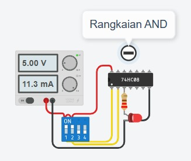
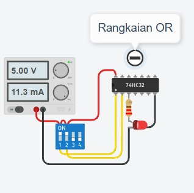
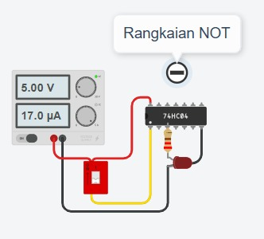
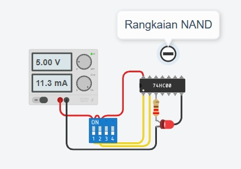
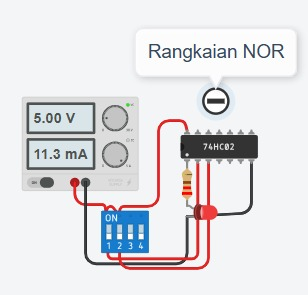
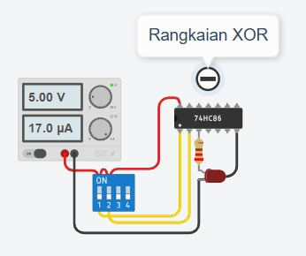
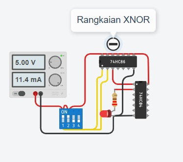

# penjelasan-rangkain-7-logic-gate
## Link Tinkercad
https://www.tinkercad.com/things/80MAp5CFO0z-rangkaian-gerbang-logika/editel?returnTo=https%3A%2F%2Fwww.tinkercad.com%2Fdashboard%2Fdesigns%2Fall&sharecode=buLiAYDOueHLUGVCqFt08tow7t58n0rc2qx8vVMUZbM
# 1. Gerbang AND 

Gerbang AND adalah gerbang logika yang menghasilkan output bernilai 1 hanya jika seluruh input bernilai 1. Jika salah satu input bernilai 0, maka output akan menjadi 0.
Gerbang AND dapat dianalogikan seperti dua saklar lampu yang dipasang seri. Lampu hanya menyala apabila kedua saklar sama-sama ON.

Cara Kerja
- Jika A = 0 dan B = 0, output = 0
- Jika A = 0 dan B = 1, output = 0
- Jika A = 1 dan B = 0, output = 0
- Jika A = 1 dan B = 1, output = 1

Hal ini menunjukkan bahwa semua input harus bernilai 1 agar output menjadi 1.

# 2. Gerbang OR 

Gerbang OR adalah gerbang logika yang menghasilkan output 1 jika salah satu input bernilai 1. Output hanya menjadi 0 jika seluruh input bernilai 0.
Gerbang OR dapat dianalogikan seperti dua saklar paralel. Lampu akan menyala jika salah satu saklar dinyalakan.

Cara Kerja
- Jika semua input 0 maka output 0
- Jika salah satu input 1 maka output 1
- Jika semua input 1 maka output tetap 1

# 3. Gerbang NOT

Gerbang NOT disebut juga inverter karena berfungsi membalik nilai logika input.

- Input 1 menjadi output 0
- Input 0 menjadi output 1

Gerbang ini hanya memiliki satu input dan satu output.

Cara Kerja

- Gerbang NOT bekerja dengan cara membalik kondisi logika masukan.

# 4. Gerbang NAND

Gerbang NAND merupakan gabungan dari gerbang AND dan NOT. Output akan menjadi kebalikan dari hasil AND.
Gerbang NAND menghasilkan output 0 hanya ketika semua input bernilai 1.

Cara Kerja
- Semua kombinasi menghasilkan output 1
- Kecuali jika semua input bernilai 1 maka output menjadi 0

# 5. Gerbang NOR

Gerbang NOR adalah kombinasi dari OR dan NOT. Output akan bernilai 1 hanya jika semua input bernilai 0.

Cara Kerja
- Output bernilai 1 jika semua input 0
- Jika salah satu input 1 maka output menjadi 0

# 6. Gerbang XOR

XOR (Exclusive OR) menghasilkan output 1 jika kedua input berbeda.
Jika kedua input sama, maka output bernilai 0.

Cara Kerja
- Input berbeda → output 1
- Input sama → output 0

# 7. Gerbang XNOR

XNOR adalah kebalikan dari XOR. Output bernilai 1 jika kedua input sama.

Cara Kerja
- Input sama → output 1
- Input berbeda → output 0

  
